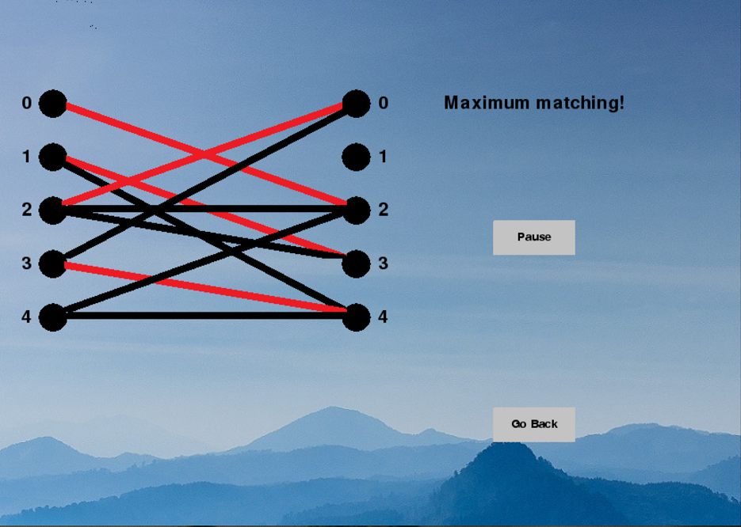
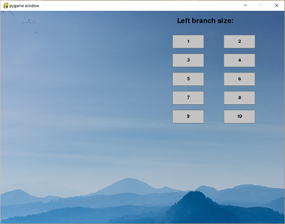
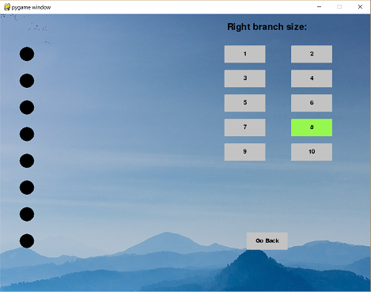
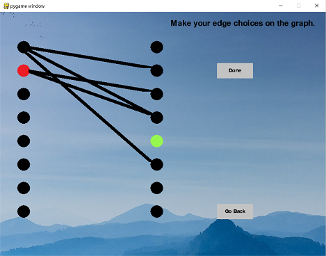
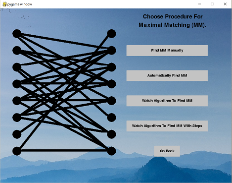
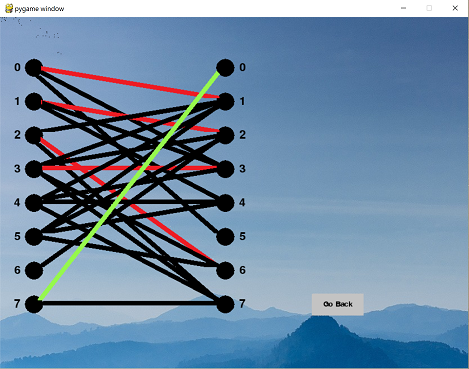
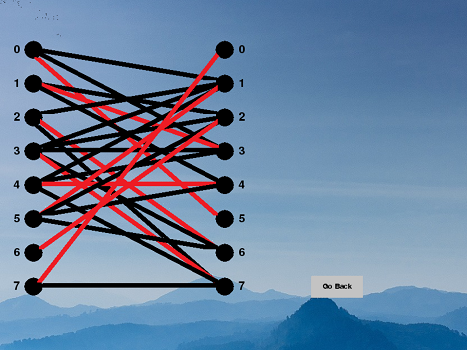
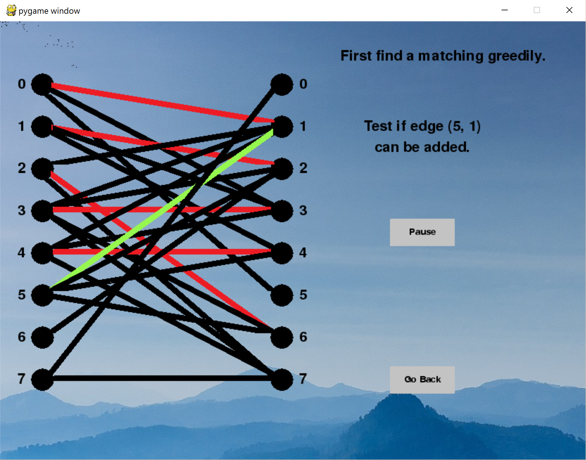
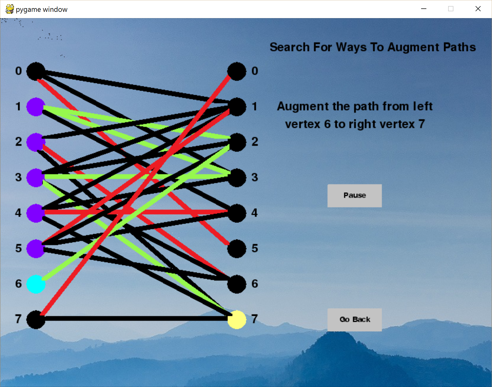

# Maximum Matchings

<p align="center">
  
</p>

This application demonstrates an algorithm for finding maximum matchings in bipartite graphs. The general procedure used begins with finding any maximal matching greedily, then expanding the matching using augmenting paths via almost augmenting paths. For a detailed explanation of the concepts involved, see `Maximum_Matchings.pdf`.

The user can choose the bipartite graph in various ways or add edges randomly. There is then a series of selection options for demonstrating the algorithm.

This project was created using Python along with the `pygame` and `livewires` packages.

## Navigating Through The Application

Important: To navigate throughout the pages of the program, there are buttons which can be hovered over. To push the buttons you must push the space bar while hovered over, rather than clicking.

The application begins with a page for selecting the left branch size.

<p align="center">
  
</p>

This is followed by a similar page for selecting the right branch size.

<p align="center">
 
</p>

The user may then elect to choose edges manually or to allow the program to randomly select edges, adding any individual edge using a pseudo-random number generator with probability 40%. Below is a view for making edge selections manually.

<p align="center">
  
</p>

The user is then taken to a page for selecting the type of operation to apply.

<p align="center">
  
</p>

Upon selecting the manual matching option, the user is allowed to select edges of the graph to try to find a maximum matching. Congratulations are given upon succeeding.

<p align="center">
  
</p>

Upon selecting the automatic matching option, a maximum matching is immediately displayed.

<p align="center">
  
</p>

Upon selecting the option to watch the algorithm, the steps of the algorithm will be displayed with changes occurring every few seconds (with a pause button available). The first image below is a still of the initial greedy matching generation and the second image below is a still of the identification of an augmenting path to increase the size of the matching.

<p align="center">
  
  
</p>

The fourth option also displays the steps of the algorithm but with buttons to follow the steps.

## Downloading The Project

* You will need to have Python installed, as well as the `pygame` and `livewires` libraries. The version of `livewires` used for this project was taken from this [download](http://www.delmarlearning.com/companions/content/1435455002/downloads/index.asp?isbn=1435455002) (which also contains downloads for Python and `pygame`), under "Book related software". To download Python only, visit this [page](https://www.python.org/downloads/).

  Note: I recommend using the versions of `livewires`, `pygame`, and Python provided at the first link; otherwise, you may encounter issues with compatibility between the standard `livewires` package and version 3.x or higher of Python.
* To download, you can clone the repository using this terminal command:
  ```
  git clone https://github.com/wbchristerson/perfect-matchings.git
  ```

Alternatively, follow the instructions below to download to a hard drive:
* Click the green "Clone or download" button above then choose "Download ZIP".
* Find the folder `perfect-matchings-master` in your Downloads folder or wherever it was placed on your device.
* Right click and choose "Extract All".
* From within the directory generated through extraction (named `perfect-matchings-master`, unless you changed the file name), double click on the batch file `main.bat`. A window will open on screen, beginning the program.

If you encounter errors involving `pygame` or `livewires`, make sure that those packages are installed in `lib/site-packages` from the level of the directory containing this project.

## Sources
The content of `Maximum_Matchings.pdf` and the algorithm itself are largely based on "Discrete Mathematics: Elementary And Beyond", by L. Lovasz, J. Pelikan, K. Vesztergombi, Print, 2003 Springer-Verlag New York, Inc., p. 171-176.

The background image used was publicly available through [Unsplash](https://unsplash.com/) and taken by user [bady qb](https://unsplash.com/@bady). Thank you, bady qb!
