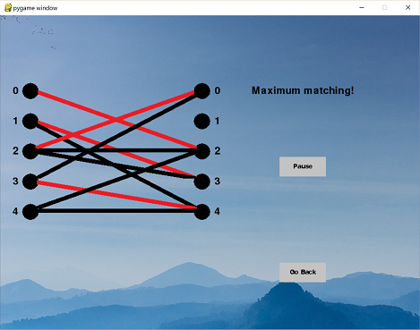

# Maximum Matchings

<p align="center">
  
</p>

This application demonstrates an algorithm for finding maximum matchings in bipartite graphs. For a detailed explanation of the concepts involved, see `Maximum_Matchings.pdf`. The project was created using Python along with the pygame and livewires libraries.

## Navigating Through The Application


Important: To navigate throughout the pages of the program, there are buttons which can be hovered over. To push the buttons, rather than clicking, you must push the space bar.

## Downloading The Project

* You will need to have Python installed, as well as the `pygame` and `livewires` libraries. The version of `livewires` used for this project was taken from this [download](http://www.delmarlearning.com/companions/content/1435455002/downloads/index.asp?isbn=1435455002) (which also contains downloads for Python and `pygame`), under "Book related software".
* To download, you can clone the repository using this terminal command:
```
git clone https://github.com/wbchristerson/perfect-matchings.git
```

Alternatively, follow the instructions below to download to a hard drive:
* Click the green "Clone or download" button above then choose "Download ZIP".
* Find the folder `perfect-matchings-master` in your Downloads folder or wherever it was placed on your device.
* Right click and choose "Extract All".
* From within the directory generated by extracting (named `perfect-matchings-master`, unless you changed the file name), double click on the batch file `main.bat`. A window will open on screen, beginning the program.

* If you encounter errors involving `pygame` or `livewires`, make sure that those packages are installed in `lib/site-packages` from the level of the directory containing this project.

## Sources
The content of `Maximum_Matchings.pdf` and the algorithm itself are largely based on "Discrete Mathematics: Elementary And Beyond", by L. Lovasz, J. Pelikan, K. Vesztergombi, Print, 2003 Springer-Verlag New York, Inc., p. 171-176.

The background image used was publicly available through Unsplash and taken by user [bady qb](https://unsplash.com/@bady).
